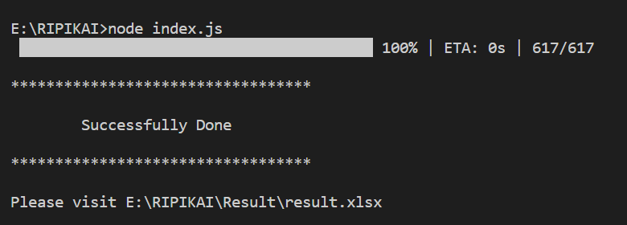

# RIPIKAI-Hackathon
[](https://opensource.org/licenses/MIT)

    node version v14.18.0 

#### Follow below Steps
- Step-1
    ```git clone https://github.com/debadutta98/RIPIKAI-Hackathon.git```

- Step-2

    ``` npm i ```

- Step-3

    ``` node index.js  ```

    

- Step-4

    See the result [here](./Result/result.xlsx)

    

##### <center>Made with ❤️❤️ by Debadutta Panda</center>